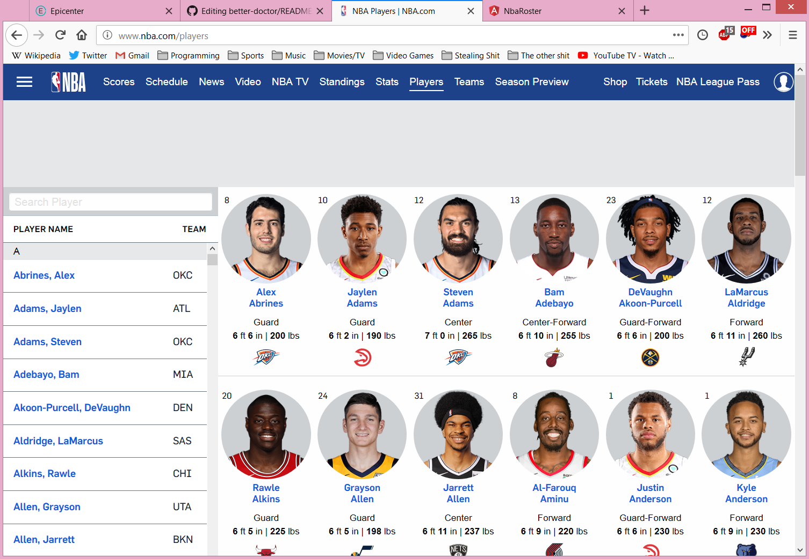

# NBA.com/players Site Clone

### _Created By_ **Joe Friesen**

## Description

This application is an attempt to recreate the page https://www.nba.com/players using the Angular framework and data obtained from the stats.nba.com API. Submitted for Epicodus code review on 10/19/2018 and 10/26/2018.

## Screenshots

https://www.nba.com/players as it appeared on 10/19/2018


## Technologies Employed

* [stats.nba.com API](https://stats.nba.com)
* Angular 6
* Firebase for hosting/database management
* Webpack
* HTML
* JavaScript
* CSS

## Installation Instructions

* *Clone this repository:*
  * In terminal, enter the following:
```
$ cd ~/desktop
$ git clone https://github.com/josephfriesen/nba-roster.git
$ cd nba-roster
```
* *Build:*
  * In terminal, enter
```
$ ng serve
```
* *Open:*
  * In a browser, navigate to *localhost:4200/*

### Legal

Copyright (c) 2018 [Joseph Friesen](mailto:friesen.josephc@gmail.com)
