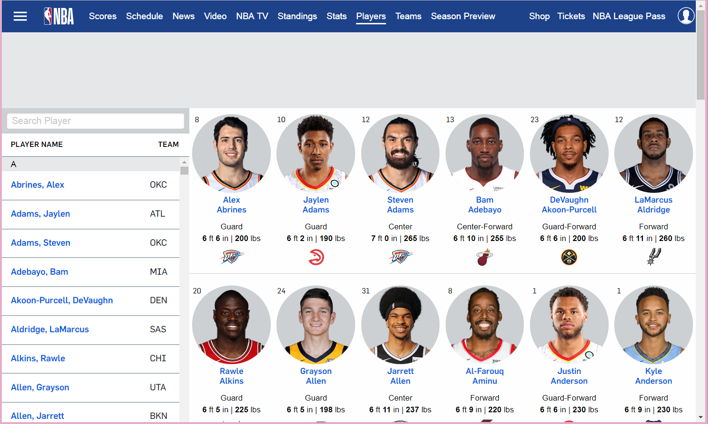
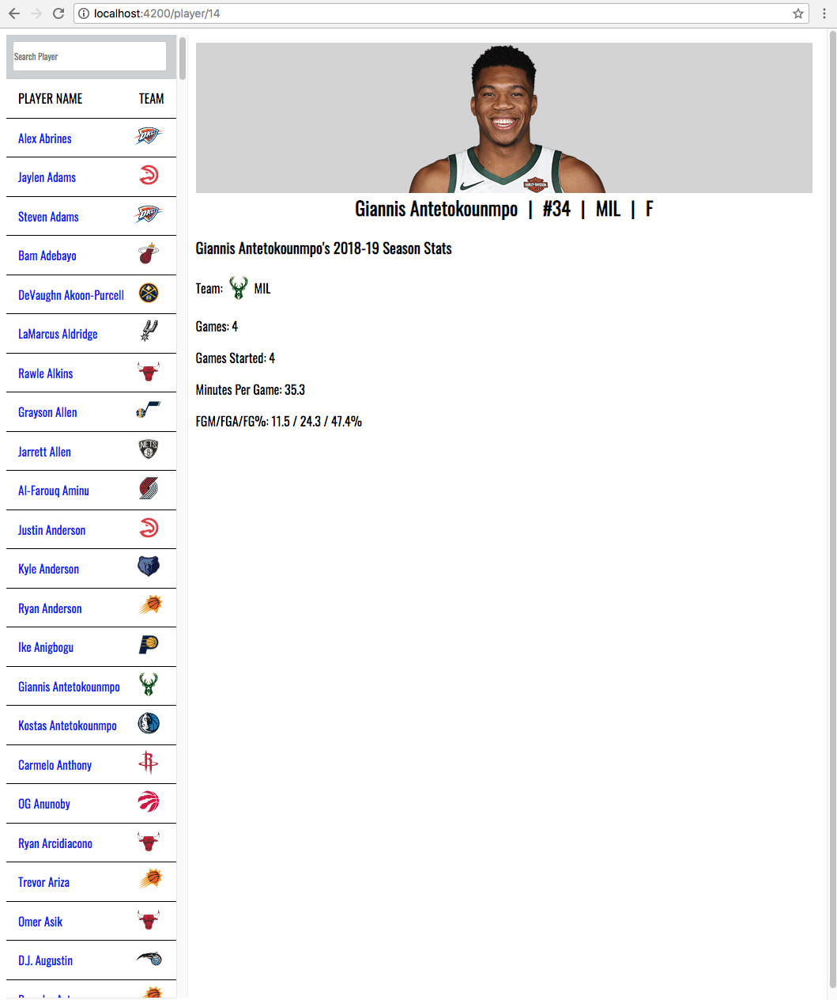

# NBA.com/players Site Clone

### _Created By_ **Joe Friesen**

## Description

This application is an attempt to recreate the page https://www.nba.com/players using the Angular framework and data obtained from the stats.nba.com API. On the first page, the app will display a searchable sidebar listing all NBA players and their team (as of the beginning of the 2018-19 season), with a grid view of each player in the main view giving the player's name, number, team, height, weight, and a thumbnail image of the player. Each name in the sidebar is clickable, and clicking will take you to the details page for that player, which will make a stats.nba.com API call and print that player's 2018-19 season to-date per-game statistics to the main display.

Submitted for Epicodus code review on 10/19/2018 and 10/26/2018.

## Screenshots

https://www.nba.com/players as it appeared on 10/19/2018


Initial Application view


Player Detail View


## Technologies Employed

* [stats.nba.com API](https://stats.nba.com)
* Angular 6
* Firebase hosting/realtime database
* Webpack
* HTML/CSS
* JavaScript

## Installation Instructions

* *Clone this repository:*
  * In terminal, enter the following:
```
$ cd ~/desktop
$ git clone https://github.com/josephfriesen/nba-roster.git
$ cd nba-roster
```
* *Build:*
  * In terminal, enter
```
$ ng serve
```
* *Open:*
  * In a browser, navigate to *localhost:4200/*

### Legal

Copyright (c) 2018 [Joseph Friesen](mailto:friesen.josephc@gmail.com)
